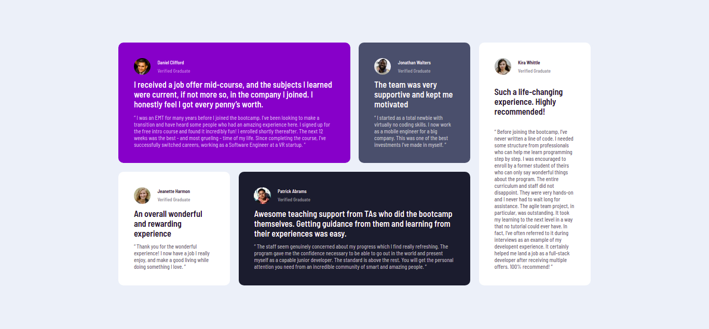

# Frontend Mentor - Testimonials grid section solution

This is a solution to the [Testimonials grid section challenge on Frontend Mentor](https://www.frontendmentor.io/challenges/testimonials-grid-section-Nnw6J7Un7). Frontend Mentor challenges help you improve your coding skills by building realistic projects. 

# Challenge
The Challenge was to create a reponsivelayout of the given design and designguide along with some best coding practices andfinally hosting the website.

## Screenshots

### Desktop 

### Mobile
 

## Tools Used

- Html
- Scss
    - partials
    - mixin
    - loops
    - nesting
    - variables
- BEM naming

## Author

> Hey there!! I am pranay. I enjoyed working on this challenge and finally completing it. Initially i need to watch some tutorials about SASS since I was new at it but glad to complete this project.

> Loved my Work!! Consider giving it a STAR:)